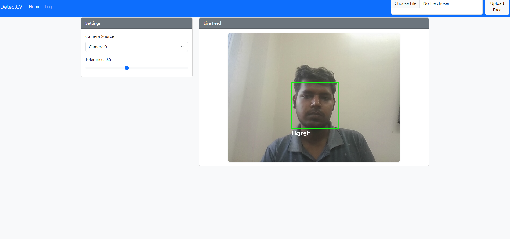
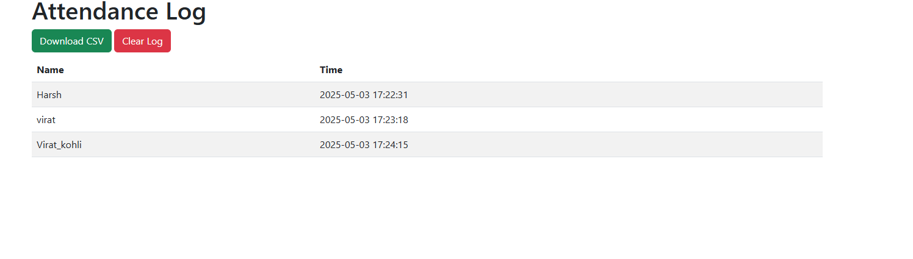

# DetectCV: Real-Time Face Recognition Attendance System

DetectCV is a Flask-based web application that provides real-time face recognition for attendance tracking. It supports multi-camera selection, adjustable recognition tolerance, and a clean dashboard for managing known faces and attendance logs.

## Features

- **Real-Time Face Recognition**: Uses `face-recognition` and OpenCV to identify faces from webcam input.
- **Multi-Camera Support**: Choose between multiple camera sources (e.g., built-in, USB) via dropdown.
- **Dynamic Tolerance**: Adjust the face distance threshold to control matching strictness.
- **Web-Based Dashboard**: Responsive UI built with Bootstrap 5 for uploading reference images and viewing live feed.
- **Attendance Management**:
  - Automatic logging of first-time recognized faces to `Attendance.csv` with timestamp.
  - View attendance records through a web interface.
  - Download attendance as CSV and clear logs.

## Project Structure

```
DetectCV/
├── app.py
├── config.py
├── requirements.txt
├── known_faces/           # Reference images (.jpg, .png)
├── Attendance.csv         # Generated attendance log
├── static/
│   ├── css/
│   │   └── styles.css     # Custom CSS
│   └── js/
│       └── script.js      # Camera & tolerance controls
└── templates/
    ├── index.html         # Main dashboard
    └── attendance.html    # Attendance log view
```

## Dependencies

The following key libraries and tools are used in this project:

- **Flask (2.3.2)**: Web framework for routes, templating, and HTTP handling.
- **OpenCV (4.5.4.60)**: Video capture and image processing.
- **face-recognition (1.3.0)**: Face encoding and matching built atop dlib.
- **dlib (19.24.2)**: Underlying C++ library for facial landmark detection and embedding.
- **NumPy (1.19.5)**: Numerical operations, especially on image arrays.
- **CMake (3.18.4)**: Build tool required by dlib installation.

## Architecture

DetectCV follows a modular MVC-like pattern:

- **Configuration (config.py)**: Centralizes settings such as tolerance threshold, camera index, and file paths.
- **Model (Face Recognition)**:
  - _Face Encoding Loader_: Reads images from `known_faces/`, computes 128‑d embeddings via `face-recognition`.
  - _Distance Matching_: Compares live-frame embeddings against known encodings using Euclidean distance.
- **View (Templates)**:
  - _Dashboard (index.html)_: Bootstrap-based UI for camera/tolerance controls and live feed.
  - _Attendance Log (attendance.html)_: Tabular listing with download/clear actions.
- **Controller (app.py)**:
  - _Routes_: Handle HTTP GET/POST for dashboard, video stream, attendance viewing, file upload.
  - _Video Generator_: Captures frames, detects faces, matches names, logs attendance, streams MJPEG.
- **Static Files**:
  - _CSS/JS_: Custom scripts for dynamic slider/camera selection and styling.

## Installation

1. **Clone the repository**:

   ```bash
   git clone https://github.com/yourusername/DetectCV.git
   cd DetectCV
   ```

2. **Create a Python virtual environment** (optional but recommended):

   ```bash
   python -m venv .venv
   source .venv/bin/activate  # Linux/Mac
   .venv\Scripts\activate    # Windows
   ```

3. **Install dependencies**:

   ```bash
   pip install -r requirements.txt
   ```

4. **Prepare reference images**:
   - Add `.jpg`, `.jpeg`, or `.png` files named after the person (e.g., `alice.jpg`) into `known_faces/`.

## Configuration

Edit `config.py` to adjust:

- `TOLERANCE`: Face distance threshold (default `0.5`).
- `DEFAULT_CAMERA`: Camera index (default `0`).
- `REFERENCE_FOLDER`: Path to known faces directory.
- `ATTENDANCE_FILE`: CSV output for attendance logs.

## Usage

1. **Run the application**:

   ```bash
   python app.py
   ```

2. **Access the dashboard**:
   Open a web browser and navigate to `http://127.0.0.1:5000/`.

3. **Upload reference images**:

   - Use the file upload form in the navbar to add new faces.
   - The app will automatically reload known faces.

4. **View live recognition**:

   - Select camera source and adjust tolerance in the Settings panel.
   - The Live Feed panel shows real-time face detection.

5. **Manage attendance**:
   - Click **Log** in the navbar to view all recognized attendance records.
   - Download the CSV or clear the log using the provided buttons.

---



